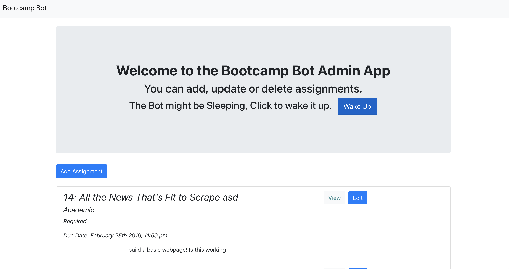

# hmwrk_bot administrative page

[Deployed Site](https://hmwrk-bot.herokuapp.com/)

[Bot GitHub](https://github.com/harrysuk/bootcampbot)

### Overview

* The admin dashboard will allow adminstrators to login and Create, Update, Read and Delete assignments.

* The app will store all assignments in a mongo database.

* Built with a React frontend that proxies to an Express backend.

* Must be an admin logged in with Github to view the dashboard.

* The code for the bot can be found by clicking the Bot Github link.

## Installation

To install the application follow the instructions below:

	git clone https://github.com/Bgosse1/hmwrk_bot.git
	cd hmwrk_bot
	npm install
    cd to client folder
    npm install

## Configuration

An OAuth App in GitHub needs to be created as well as a slack app

Once you have the slack app setup, you will need to install it into your slack workspace.

You .env file should have the following values: 
    MY_SLACK_SIGNING_SECRET = slack app signing secret 
    GITHUB_CLIENT_ID = GitHub Client Id 
    GITHUB_CLIENT_SECRET = GitHub Client Secrect 
    GITHUB_CALLBACK_URL = http://localhost:3001/return 
    SLACK_BOT_TOKEN = slack app token 
    GITHUB_AUTH_URL=http://localhost:3001/api/authenticate 
    FRONTEND_URL=http://localhost:3000/ 
    
## Running Locally

To run the application locally and access it in your browser, cd to the root of the project then run

	npm run start
	
The application will now be running locally on port 3000. You can then access it locally from your browser at the URL `localhost:3000`.